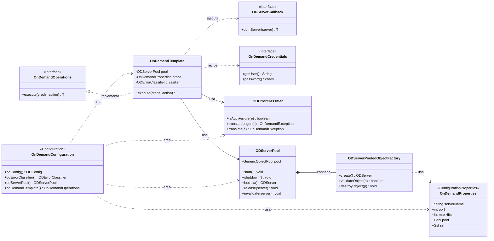
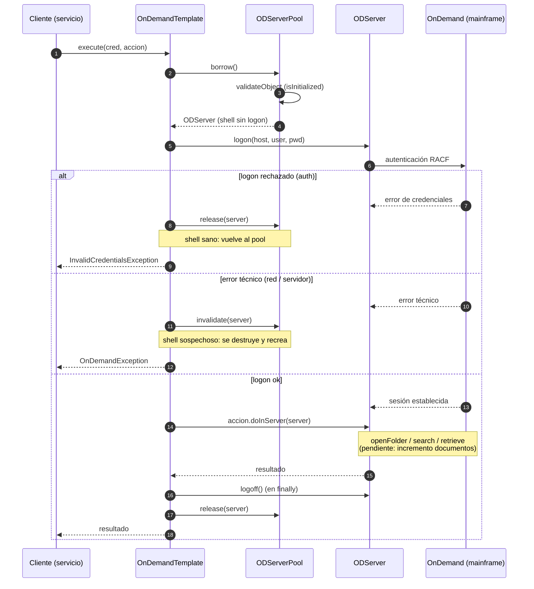
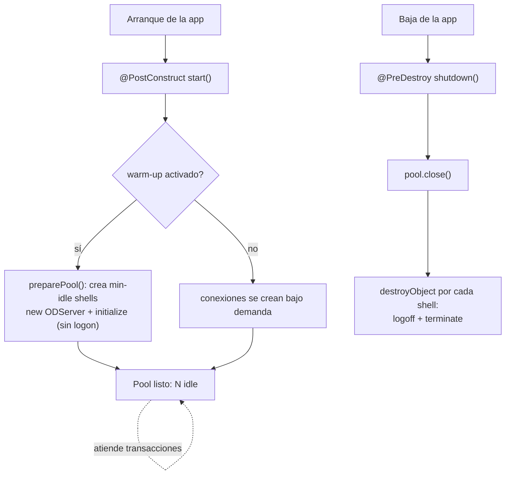

# Módulo OnDemand — Pool de conexiones ODServer

Alcance actual del entregable: **solo la capa de conexión a OnDemand** (pool de
objetos `ODServer` + template). Aún no incluye sesiones (quién produce el
`OnDemandCredentials`) ni documentos (quién usa `OnDemandOperations`).

Paquete raíz: `mx.infotec.imss.infrastructure.odwek`

```
infrastructure/odwek/
├── config/        OnDemandConfiguration, OnDemandProperties
├── connection/    OnDemandOperations, OnDemandTemplate, ODServerCallback,
│                  OnDemandCredentials, ODErrorClassifier, excepciones
└── pool/          ODServerPool, ODServerPooledObjectFactory
```

---

## 1. Diagrama de clases

Relaciones entre las piezas del módulo. `OnDemandConfiguration` crea los beans;
`OnDemandTemplate` (adaptador del puerto `OnDemandOperations`) orquesta el pool,
el clasificador de errores y las credenciales.



---

## 2. Diagrama de secuencia — una transacción

Camino de `execute(...)`: tomar un shell del pool, logon con la credencial del
usuario, ejecutar la acción de negocio y, en el `finally`, logoff con devolución
o invalidación según el tipo de error.



---

## 3. Ciclo de vida del pool (independiente de la transacción)



---

## Notas

- El **pool guarda shells** (`ODServer` inicializados **sin** logon). El logon/logoff
  por usuario ocurre por transacción dentro del template.
- **Validación en borrow** vía `isInitialized()`. Si es false, Commons Pool2 destruye
  el shell y crea uno nuevo de forma transparente. La conexión TCP muerta no la
  detecta `isInitialized`; la atrapa el template al fallar el `logon`.
- **auth vs técnico**: un logon rechazado por RACF deja el shell sano (`release`);
  un error técnico lo marca sospechoso (`invalidate`). Así no se revoca el userid
  por reintentos ni se reutiliza una conexión rota.
- `max-total` = número de **transacciones OnDemand concurrentes** (cruzar con el
  límite de conexiones/licencia del servidor z/OS).
